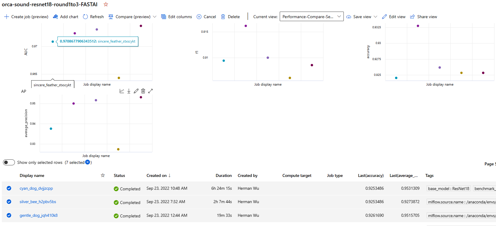
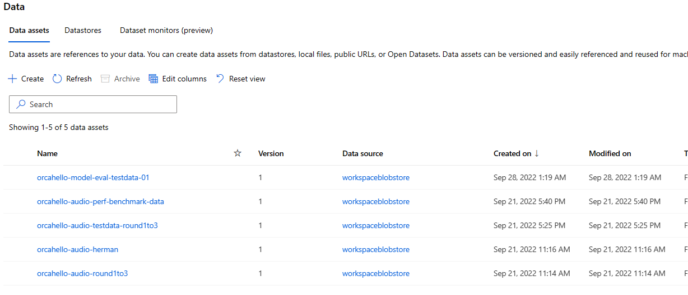

# orcasound-mlops

MLOps system for the Orca Call Detection machine learning

If you are new to the project, please read [[quick-start]] first to understand the whole picture and key resources in the project.

In the `notebooks` folder, there are several notebooks that are modified from [ModelTraining](https://github.com/orcasound/aifororcas-livesystem/tree/main/ModelTraining). We added AML integration so we can retrieve and reuse datasets. These notebooks also add Model performance tracking/logging features using MLFlow SDK.

  

These notebooks can help you quickly run the training using shared resources in AML without manually setup the environment and downloading the dataset.

  

- [ ] TODO: `4_Model_Evaluation-AML.ipynb` is still working in progress. It is intended to provide a common ground for comparing different models. Unfortunately, some outdated libraries block data processing.