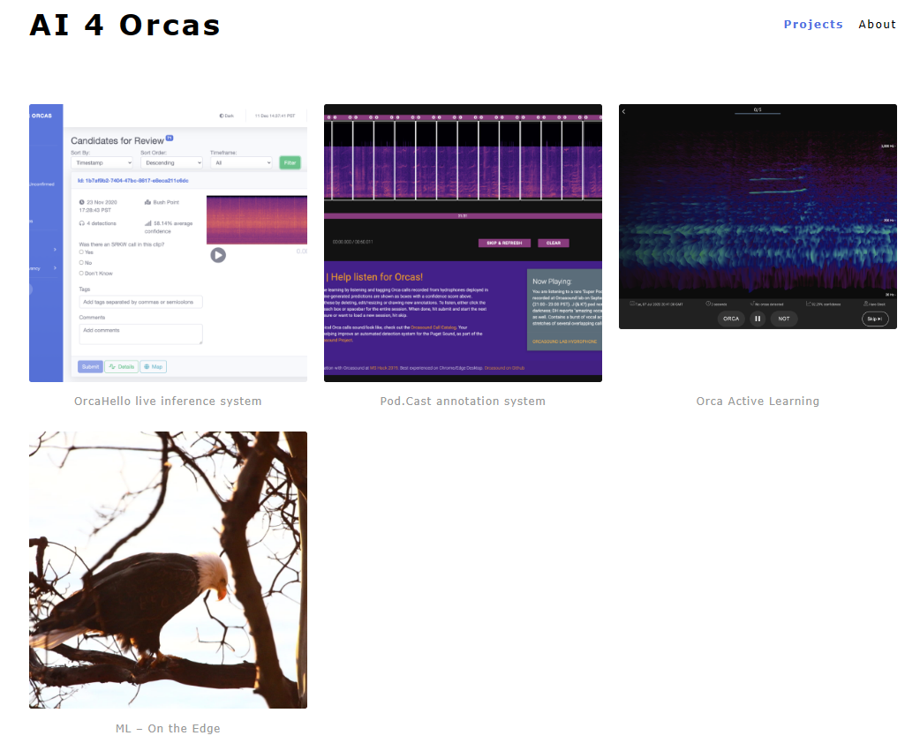

## Quick Start Guide for MS Hackathon 2022

### What are the main systems now?

Current System Introduction 👉 [AI 4 Orcas](https://ai4orcas.net/portfolio/)

- [OrcaHello live inference system](https://ai4orcas.net/portfolio/orcahello/)

- [Pod.Cast annotation system](https://ai4orcas.net/portfolio/pod-cast-annotation-system/)
- [Orca Active Learning](https://ai4orcas.net/portfolio/orca-al/)
- [ML -- On the Edge](https://ai4orcas.net/portfolio/ml-on-the-edge/)

  

### Understand the current ML model

- Check  [aifororcas-livesystem/ModelTraining at main - orcasound/aifororcas-livesystem - GitHub](https://github.com/orcasound/aifororcas-livesystem/tree/main/ModelTraining)

- Other ML Research : [orcasound](https://github.com/orcasound)/**[orcaal-research](https://github.com/orcasound/orcaal-research)**

### Where is the labeled data stored ?

<!-- #onedrive -->

Please use `mldata.7z` or `TrainDataLatest_PodCastAllRounds_123567910.tar.gz` as your training data. 

- Data for current Model [One Drive Data link 👉🌐 ](https://microsoft-my.sharepoint.com/:f:/p/aaagraw/EpK2FvtpbRBDt76EwoKPuHoB8ll9WSXNPGhRX63OTg-1Jw?e=550aE2)

    -   **Models/stg2-rn18.pkl** - Trained ResNet18 model
    -   **mldata.7z** is data used for training the model
    -   **All.zip** is testing data for early evaluations
    -   **test2Sec.zip** is data used for scoring for official evaluations

  

- More Labeled data 
    - [Pod.Cast data archive - orcasound/orcadata Wiki (github.com) 👉🌐](https://github.com/orcasound/orcadata/wiki/Pod.Cast-data-archive)
    - `TrainDataLatest_PodCastAllRounds_123567910.tar.gz` contains all 10 rounds of data available to date (5.1 GB gzip, 6/29/2022)
- More Labeled Data are stored in the COSMOS DB of  [OrcaHello live inference system](https://ai4orcas.net/portfolio/orcahello/)
- Key Data Project 
    - [orcasound](https://github.com/orcasound)/**[orcadata](https://github.com/orcasound/orcadata)**

### ✨What we can/want do in ML Track 
- Train and Test different ML models
- Build MLOps process 
    - Model Performance Evaluation 
    - Model Management 
    - Model Deployment
- Get more labeled data from [OrcaHello live inference system](https://ai4orcas.net/portfolio/orcahello/)
    - Labeled data is stored in Azure Cosmos DB 

### ✨How I can submit my work ?

- create branch and push to github 
    - GitHub Repo: [orcasound](https://github.com/orcasound)/**[orcasound-mlops](https://github.com/orcasound/orcasound-mlops)**
- submit PR to main branch
- collaborate in [Teams Channel](https://teams.microsoft.com/l/channel/19%3a9e79535ad8b9490ea224fb6d2dde3fa2%40thread.skype/ML%2520Development?groupId=19add7a0-1ea1-4c28-b5b6-1d25ef5c2d79&tenantId=72f988bf-86f1-41af-91ab-2d7cd011db47)
- Slack Hackathon Channel : [hackathons](https://orcasound.slack.com/archives/CE5797R54)

### What do Orca sound like?

- [Orcasound Live 👉🌐](https://live.orcasound.net/)

### More about Project History 

[AI for orcas: open bioacoustic data science -- Orcasound](https://www.orcasound.net/portfolio/ai-for-orcas-open-bioacoustic-data-science/)

